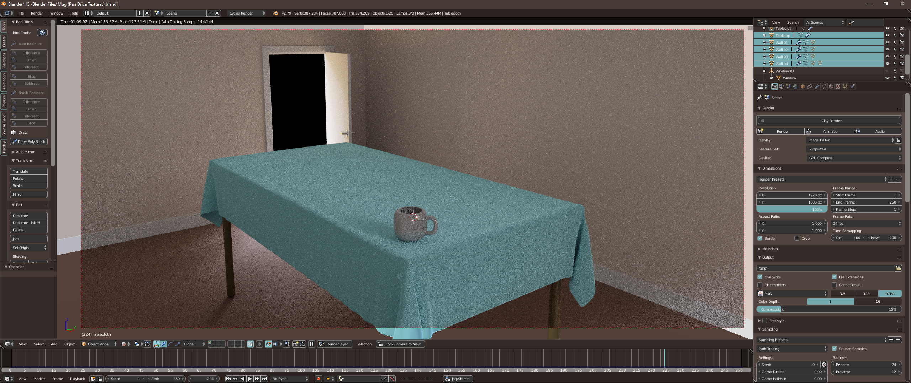

# Pop_Theme for [Blender](https://www.blender.org)

> A flat theme for [Blender](https://www.blender.org) based on Pop_OS! by System76.

## Install

Download/clone the Repository.
In the Themes tab of the Blender User Preferences (Ctrl Alt U) click "Install Theme..."; navigate to and select the Pop_Theme.xml file.

## Resources

The color values from this theme come from [VsCodePopTheme](https://github.com/artvandelay440/VSCodePopTheme).
Some colours are also picked from Pop!_OS Standard Backgrounds.

## Key Config

I've also put my blender key config file in this repo, mainly for personal use but use if you wish.
Currently it binds the forward and back page buttons on my mouse to repeat history (F3) and mesh select mode (edit mode - vertex/edge/face) and it binds Alt+scroll wheel to change brush size in sculpt mode.

## License

[BSD 3-Clause License](./LICENSE)
